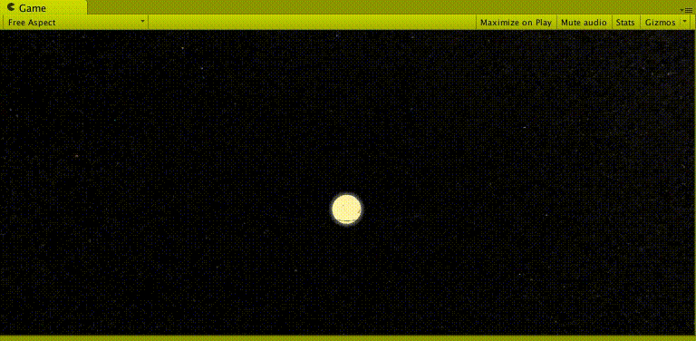

# Solar System

3D Solar System with Unity 5.




## Prerequires

1. Git 2.9+
3. Unity 2018+


## How to Play

Clone

```
git clone https://github.com/humbertodias/unity-solar-system.git
```

On Unity, open the project folder: **unity-solar-system**


## Controls

Button | Action
------ | ------
left mouse button | Rotate
middle mouse button | Zoom
right mouse button | Pan


## References

1. [Solar System Dimensions](https://solarsystem.nasa.gov)

2. [Solar System Textures](http://planetpixelemporium.com/planets.html)

3. [Wikipedia](https://en.wikipedia.org/wiki/Solar_System)


